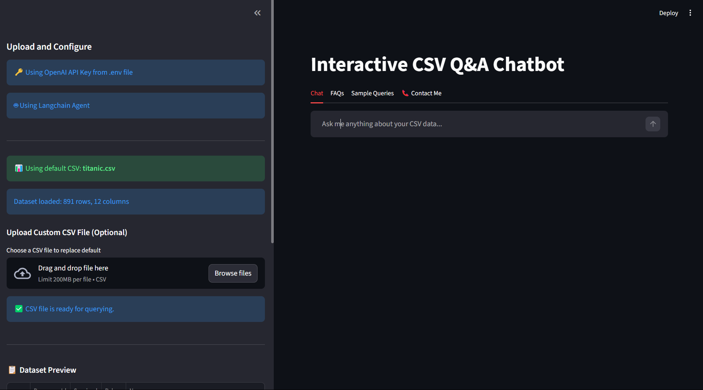
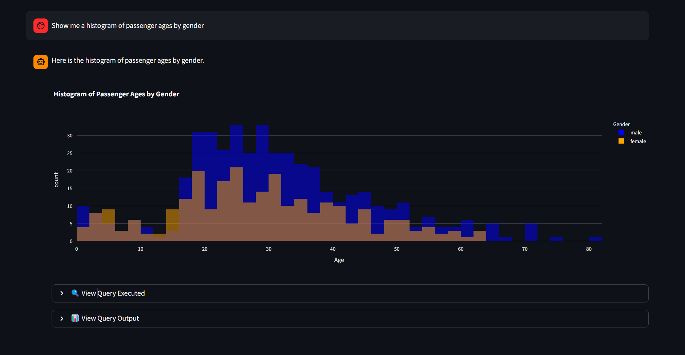
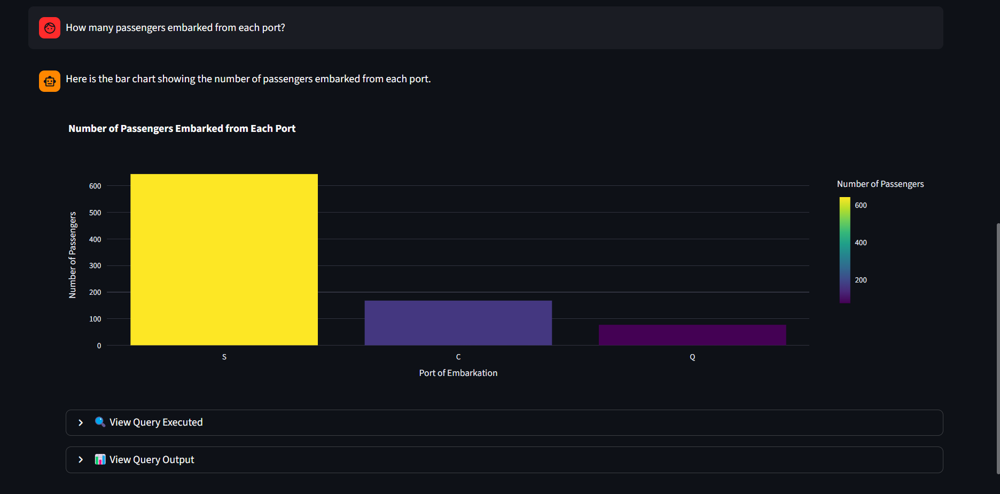

<p align="center">
  <strong>ChatwithCSV</strong>
</p>
<p align="center">
  <i>Talk to your CSV in plain English. Get answers and charts in seconds.</i>
</p>

<p align="center">
  <a href="https://chat-with-csv-latest.onrender.com/"></a>
  <a href="#-setup"></a>
  <a href="#-contact"></a>
</p>

<p align="center">
  
  
  
  
  
</p>

---

### ▶ Live demo

**[→ Open app](https://chat-with-csv-latest.onrender.com/)** · Hosted on Render. If the app is cold, allow **2–3 minutes** for the instance to spin up.

---

## Screenshots


<p align="center">
  
</p>


### Visualizations

<p align="center">
  
</p>

<br>

<p align="center">
  
</p>


---

## What it does

- **Natural-language Q&A** — Ask questions about your CSV; the app runs pandas under the hood and answers in plain English.
- **Charts on demand** — Request histograms, bar charts, pie charts; the app generates Plotly figures in the chat.
- **Transparency** — Expand "View Query Executed" to see the exact code that was run.
- **Your data or default** — Use the built-in Titanic dataset or upload your own CSV in the sidebar.

---

## Sample questions

| Type | Example |
|------|--------|
| Stats | What percentage of passengers were male? What was the average ticket fare? |
| Charts | Show me a histogram of passenger ages. Create a bar chart of passengers by embarkation port. |
| Comparisons | What was the survival rate by passenger class? Show survival rates by gender and class. |

More examples live in the **Sample Queries** tab inside the app.

---

## Setup

**Prerequisites:** Python 3.10+, [OpenAI API key](https://platform.openai.com/settings/organization/api-keys).

```bash
git clone <repo-url>
cd ChatwithCSV
python -m venv venv
venv\Scripts\activate          # Windows
# source venv/bin/activate     # macOS/Linux
pip install -r requirements.txt
```

Create a `.env` in the project root:

```env
OPENAI_API_KEY=your_key_here
```

Run:

```bash
streamlit run main.py
```

**Docker:**

```bash
docker build -t chatwithcsv .
docker run -p 8501:8501 -e OPENAI_API_KEY=your_key chatwithcsv
```

---

## Project layout

```
ChatwithCSV/
├── main.py                    # Streamlit app
├── requirements.txt
├── Dockerfile
├── static/                    # Screenshots (hero.png, chat.png, …)
└── src/
    ├── constants/             # prompts.py, sample_queries.json
    ├── data/                  # titanic.csv (default dataset)
    └── modules/               # agent_langchain, classifier_agent, plotly_tool
```

---

## Contact

<p align="center">
  <a href="mailto:pwaykos1@gmail.com"></a>
  <a href="https://www.linkedin.com/in/prajwal-waykos/"></a>
  <a href="https://github.com/praj-17"></a>
</p>

---

*Built as an assignment for a possible internship.*
